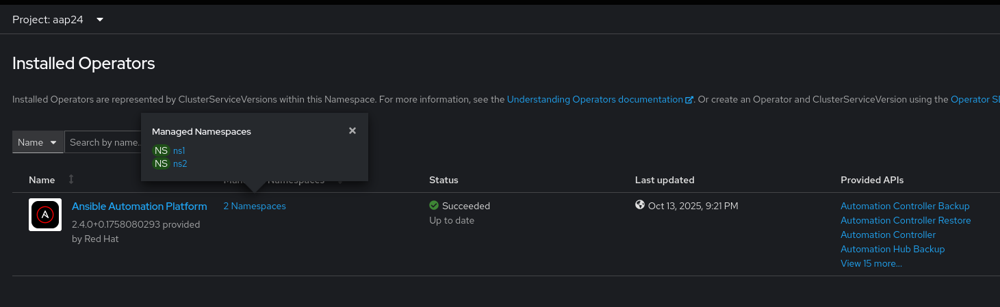
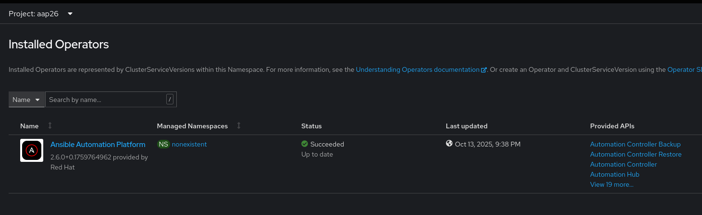
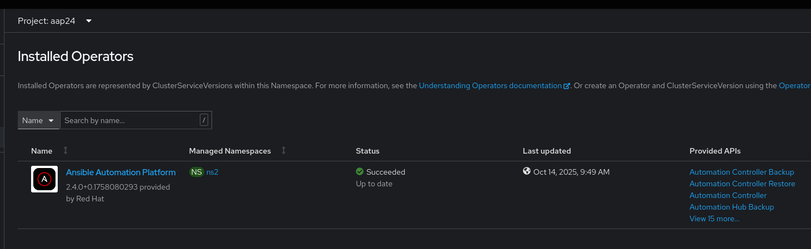
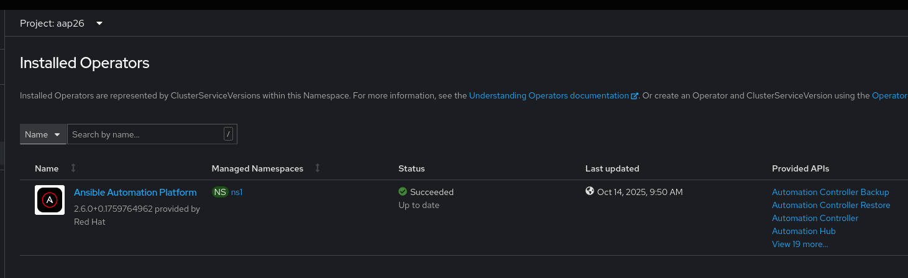
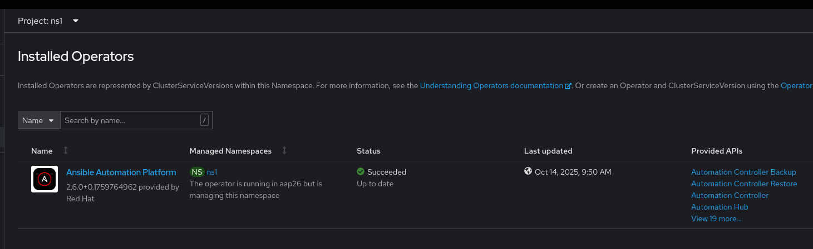
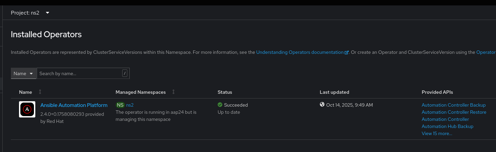

# Demo Upgrade Strategies - In Place Two Operators


The idea is to:
- Run simultaneously 2.4 and 2.6 cluster scoped operators in the same cluster.
- Remove a namespace from 2.4 and add it to 2.6 to trigger the upgrade.


## High Level Steps

We start with a single 2.4 cluster scoped operator in `aap24` namespace and managing all namespaces

1. Configure the operator to manage namespaces with AAP deployments **ONLY**
2. Deploy a second cluster scoped 2.6 operator in `aap26` namespace and managing no namespace
3. Upgrade Loop
    - a. Chose a namespace to be upgraded
    - b. Backup AAP deployments in the namespace
    - c. Remove the namespace from the first operator target namespaces list
    - d. Add the namespace to the second operator target  namespaces list
    - e. Follow the documentation to upgrade the deployments
4. Remove the 2.4 operator


## Initial State

- 3 namespaces aap24, ns1 and ns2
- AAP 2.4 cluster scope operator deployed in `aap24` managing all namespaces
- Automation Controller deployed in `ns1` and `ns2`

See [setup.md](./setup.md) for initial state instructions.


## Demo:  In-Place Two Operators


### 1. Configure the operator to manage namesapces with AAP deployments ONLY

```sh
### 1. Get the operator group name
OG_NAME=$(oc -n aap24 get og -oname)

oc -n aap24 get $OG_NAME -o json | jq '.spec.targetNamespaces'

### 2. Configure the operator to namage namespaces with AAP deployment ONLY (ns, ns2)
oc -n aap24 patch $OG_NAME --type merge -p '{"spec":{"targetNamespaces":["ns1", "ns2"]}}'

### 3. Verify
oc -n aap24 get $OG_NAME -o json | jq '.spec.targetNamespaces'

[
  "ns1",
  "ns2"
]
```

### 2. Deploy a second cluster scoped 2.6 operator in aap26 namespace, managing no namespace

Note: Setting `OperatorGroup.spec.targetNamespaces: [NON_EXISTENT]` => manage no namespace

```sh
### 1. Deploy the 2.6 operator with expected configuration
#      - create aap26 namespace
#      - Deploy 2.6 operator in aap26 namespace with `OperatorGroup.spec.targetNamespaces` 
#        set to : [NON_EXISTENT]
oc apply -f in-place-2-operators/manifests/aap26-op.yml

### 2. Approve install plan if applicable
for ip in $(oc get ip -oname -n aap26); do oc patch $ip --type merge -p '{"spec":{"approved":true}}' -n aap26; done

### 3. Wait for install to complete
CSV=$(oc -n aap26 get csv -oname)
oc -n aap26 wait $CSV --for jsonpath='{.status.phase}'=Succeeded --timeout 5m

### 4. Verify the install
oc -n aap26 get csv

NAME                               DISPLAY                       VERSION              REPLACES                           PHASE
aap-operator.v2.6.0-0.1759764962   Ansible Automation Platform   2.6.0+0.1759764962   aap-operator.v2.6.0-0.1758685241   Succeeded
```

### 3. Upgrade Loop

1. Pick a namepace to upgrade
2. Remove the namespace from 2.4 operator group
3. Add the namespace from 2.6 operator group
4. Follow the [doc](https://docs.redhat.com/en/documentation/red_hat_ansible_automation_platform/2.6/html-single/installing_on_openshift_container_platform/index#operator-upgrade_licensing-gw) to complete the upgrade

```sh
### 1. Pick a namepace to upgrade
NS=ns1

### 2. Remove the namespace from 2.4 operator group
oc -n aap24 edit og aap-og   # Remove the namespace from OperatorGroup.spec.targetNamespaces

### 3. Add the namespace from 2.6 operator group
oc -n aap26 edit og aap-og   # Add the namespace to OperatorGroup.spec.targetNamespaces

### 4. Follow the doc to complete the upgrade
oc apply -f in-place-2-operators/manifests/ns1-aap.yml

### 5. Wait for upgrade to complete
oc -n ns1 wait ansibleautomationplatform/myaap --for condition=Successful --timeout 20m
```

Repeat the steps above until all namespaces are upgraded.


## Screenshots

### Step 1: AAP 2.4 Operator Details



### Step 2: AAP 2.6 Operator Details 



### Step 3: Upgrade Loop

AAP 2.4 Operator after removing ns1



AAP 2.6 Operator after adding ns1



Deployments in ns1 are upgraded



Deployments in ns2 are not upgraded


