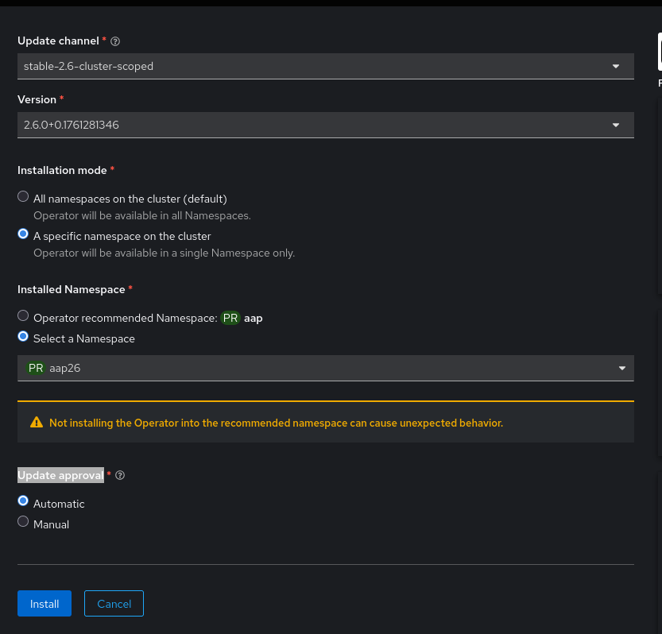
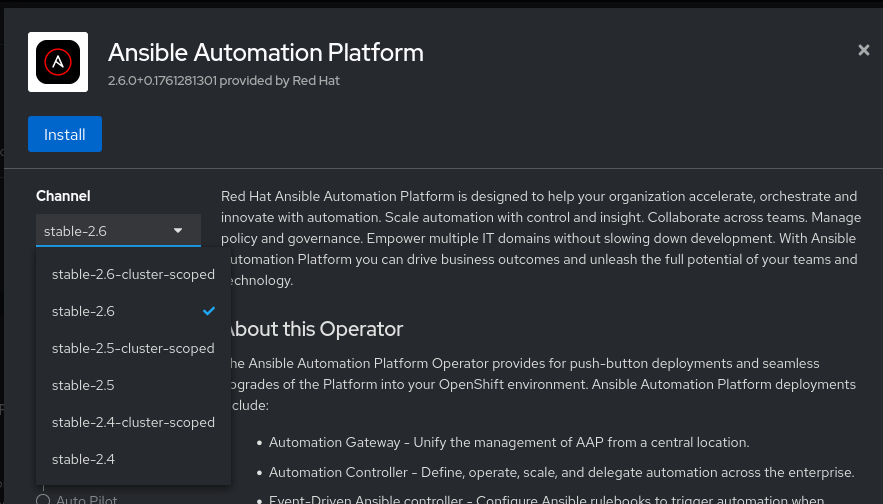
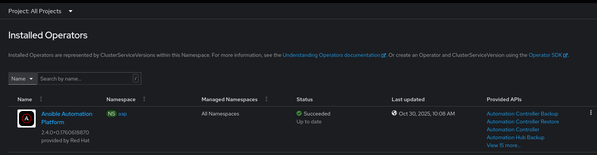
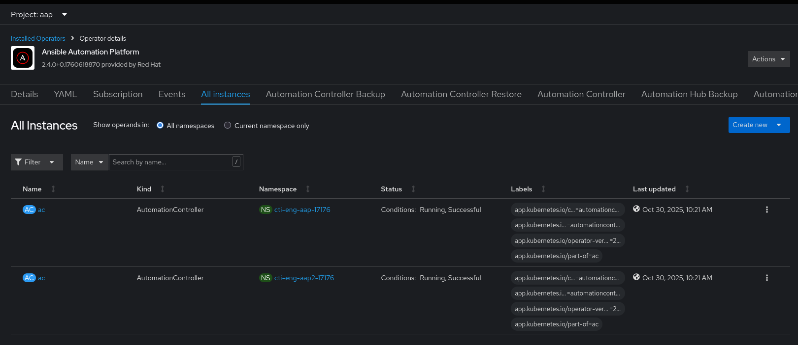
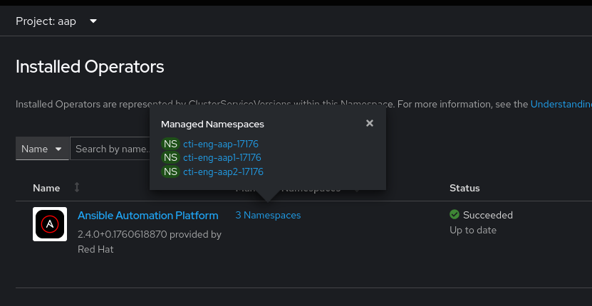
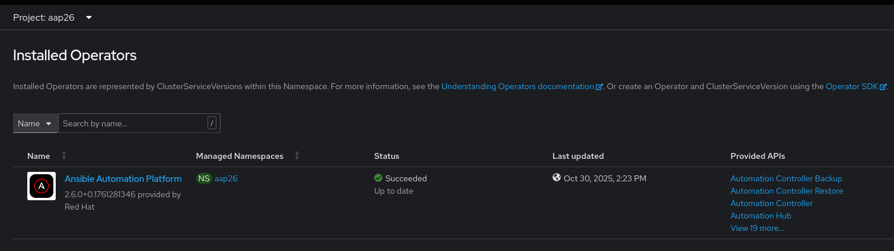
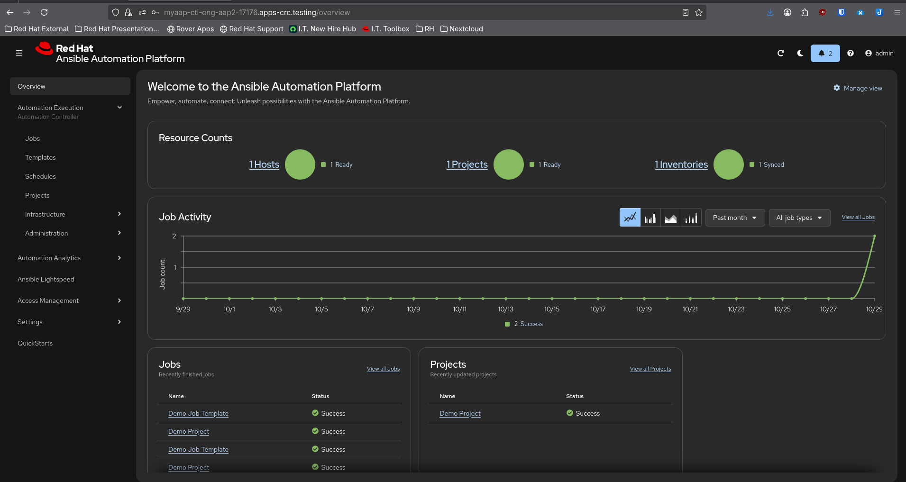
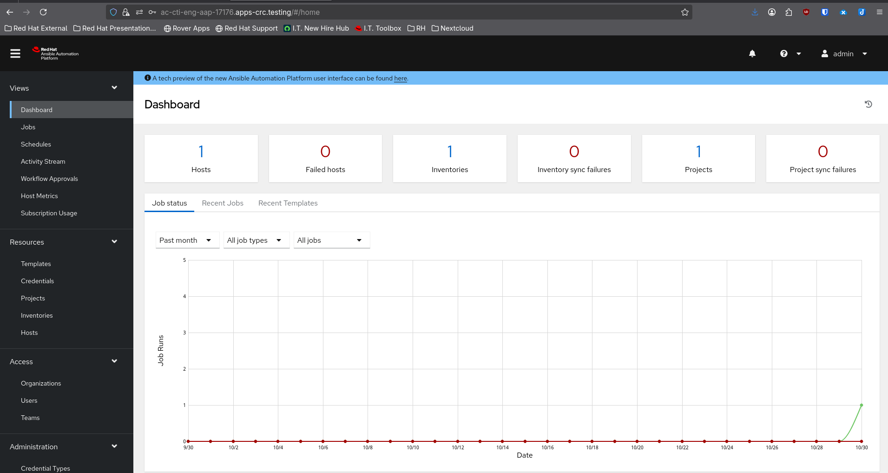

# Demo

## Initial State

- 4 namespaces: `aap`, `cti-eng-aap-17176`, `cti-eng-aap1-17176` and `cti-eng-aap2-17176`.
- A single AAP 2.4 cluster scoped operator installed in `aap` namespace, and managing all namespaces.
- Automation controller(s) deployed in `cti-eng-aap-17176` and `cti-eng-aap2-17176` namespaces.

## Prerequisites

- AAP 2.4 and 2.6 cluster scoped operator channels available (see: Screenshots 1).

## Steps

1. [OpenShift Team] Update the AAP 2.4 operator managed namespace list to include ONLY namespaces with existing AAP deployments.
2. [OpenShift Team] Install AAP 2.6 cluster scoped operator in `aap26`namespace, managing `aap26` namespace ONLY
3. Upgrade Loop
    1. Pick a namespace to upgrade
    2. Backup all deployments in the namespace
    3. [OpenShift Team] Remove the namespace from list managed by the 2.4 operator
    4. [OpenShift Team] Add the namespace to the list managed by the 2.6 operator
    5. Follow the standard approach to complete the upgrade
        - Create the secrects needed (gateway DB, SSL, etc.)
        - Create the gateway custom resource (CR)
    6. Validate the upgrade
4. Repeat step 2. until all namespaces are upgraded
5. [Optional][OpenShift Team]  Uninstall 2.4 operator and remove `aap` namespace

### 1. Update the AAP 2.4 operator managed namespace list to include ONLY namespaces with existing AAP deployments

a. Get the OperatorGroup name

```sh
OG_NAME=$(oc -n aap get og -oname)
```

b. Update the 2.4 operator managed namespace list

```sh
oc -n aap patch $OG_NAME --type merge \
  -p '{"spec":{"targetNamespaces":["cti-eng-aap-17176", "cti-eng-aap1-17176", "cti-eng-aap2-17176"]}}'
```

c. Verify

```sh
oc -n aap get $OG_NAME -o json | jq '.spec.targetNamespaces'

[
  "cti-eng-aap-17176",
  "cti-eng-aap1-17176",
  "cti-eng-aap2-17176"
]
```

### 2. Install AAP 2.6 cluster scoped operator in `aap26`namespace, managing `aap26` namespace ONLY

a. Create `aap26` namespace

```sh
oc new-project aap26
```

b. Install AAP 2.6 cluster scoped operator

```sh
oc apply -f - <<EOF
---
apiVersion: operators.coreos.com/v1
kind: OperatorGroup
metadata:
  name: aap-og
  namespace: aap26
spec:
  upgradeStrategy: Default
  targetNamespaces:              # <=== Managed namespace list
    - aap26
---
apiVersion: operators.coreos.com/v1alpha1
kind: Subscription
metadata:
  name: ansible-automation-platform-operator
  namespace: aap26
spec:
  channel: stable-2.6-cluster-scoped
  installPlanApproval: Manual
  name: ansible-automation-platform-operator
  source: redhat-operators
  sourceNamespace: openshift-marketplace
EOF
```

c. Approve the install Plan

```sh
for ip in $(oc get ip -oname -n aap26); do oc patch $ip --type merge -p '{"spec":{"approved":true}}' -n aap26; done
```

d. Wait for install to complete

```sh
CSV=$(oc -n aap26 get csv -oname)
oc -n aap26 wait $CSV --for jsonpath='{.status.phase}'=Succeeded --timeout 5m
```

e. Validate

```sh
oc -n aap26 get csv

NAME                               DISPLAY                       VERSION              REPLACES                           PHASE
aap-operator.v2.6.0-0.1761281346   Ansible Automation Platform   2.6.0+0.1761281346   aap-operator.v2.6.0-0.1760139657   Succeeded
```

### 3. Upgrade Loop


a. Pick a namepace to be upgraded

```sh
export NS=cti-eng-aap2-17176
```

b. **[OpenShift Team]** Remove the namespace from 2.4 operator group

```sh
oc -n aap edit og <AAP OG NAME>   # Remove the namespace from OperatorGroup.spec.targetNamespaces
```

c. **[OpenShift Team]** Add the namespace from 2.6 operator group

```sh
oc -n aap26 edit og aap-og   # Add the namespace to OperatorGroup.spec.targetNamespaces
```

d. Follow the doc to complete the upgrade

```sh
# Create the gateway CR

oc apply -f - <<EOF
---
apiVersion: aap.ansible.com/v1alpha1
kind: AnsibleAutomationPlatform
metadata:
  name: myaap
  namespace: $NS
spec:
  no_log: true
  controller:
    name: ac
    disabled: false
  hub:
    disabled: true
  eda:
    disabled: true
  lightspeed:
    disabled: true
EOF
```

e. Wait for upgrade to complete

```sh
oc -n $NS wait ansibleautomationplatform/myaap --for condition=Successful --timeout 20m
```

---

# APPENDIX

## A. Deploying 2.6 operator using the UI

- Got to `Operators -> OperatorHub` search for AAP and click
- Select `stable-2.6-cluster-scoped` and click on Install
- Select the following (see screenshot below)
    - **Installation mode**: A specific namespace on the cluster
    - **Installed Namespace**: Select a Namespace and choose `aap26`
    - **Update approval**: Manual
- Click Install
- Review and Approve the install plan



# Screenshots

## 1. Prerequisites: AAP 2.4 and 2.6 channels available




## 2. Initial State

A single AAP 2.4 cluster scoped operator managing all namespaces



Automation Controllers deployments



## 3. Upgrade

After updating 2.4 managed namespace list

 


After installing 2.6 operator




After first upgrade loop

AC in cti-eng-aap2-17176 namsepace upgraded to 2.6



AC in cti-eng-aap-17176 namsepace still on 2.4


