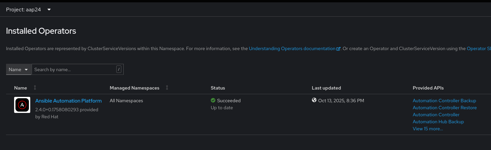
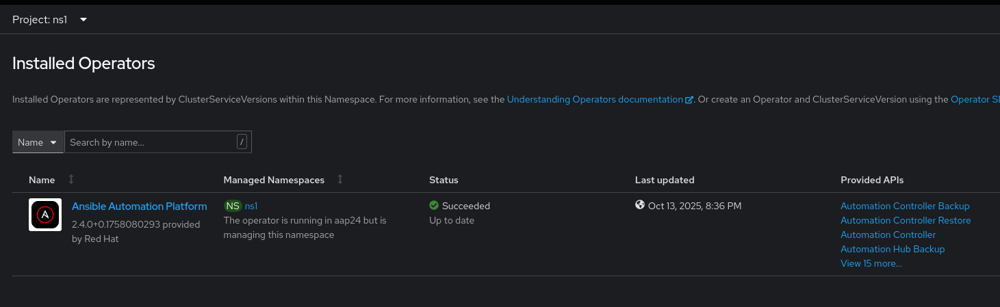
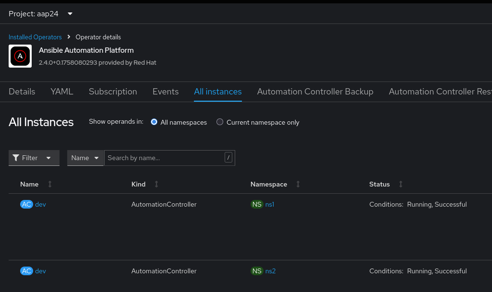

# In Place Two Operator Setup

- 3 namespaces aap24, ns1 and ns2
- AAP 2.4 cluster scope operator deployed in `aap24` managing all namespaces
- Automation Controller deployed in `ns1` and `ns2` namespaces

## Setup

### 1. Create aap24, ns1 and ns2 namespaces

```sh
oc apply -f in-place-2-operators/manifests/setup/ns.yml
```

### 2. Deploy a 2.4 cluster scoped operator in `aa24` managing all namespaces

```sh
### a. Deploy the operator
oc apply -f in-place-2-operators/manifests/setup/aap24-op.yml

### b. Approve install plan
for ip in $(oc get ip -oname -n aap24); do oc patch $ip --type merge -p '{"spec":{"approved":true}}' -n aap24; done

### c. Wait for install to complete
CSV=$(oc -n aap24 get csv -oname)
oc -n aap24 wait $CSV --for jsonpath='{.status.phase}'=Succeeded --timeout 5m

### d. Verify the install
oc -n aap24 get csv

aap-operator.v2.4.0-0.1758080293   Ansible Automation Platform   2.4.0+0.1758080293   aap-operator.v2.4.0-0.1755833968   Succeeded
```

### 3. Deploy Automation Controller in `ns1`

```sh
### a. Deploy AC in i2-ns1 namespace
oc apply -f in-place-2-operators/manifests/setup/ns1-ac.yml

### wait for AC deployment to complete
oc -n ns1 wait automationcontroller/dev --for condition=Successful --timeout 20m
```

### 4. Deploy Automation Controller in `ns2`

```sh
### a. Deploy AC in i2-ns2 namespace
oc apply -f in-place-2-operators/manifests/setup/ns2-ac.yml

### wait for AC deployment to complete
oc -n ns2 wait automationcontroller/dev --for condition=Successful --timeout 20m
```

## Screentshoots

Operator details



Operator view from ns1 namespace



Operator view from ns2 namespace


Deployments


